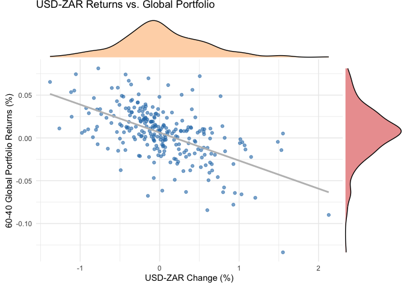

# Purpose

This is the main platform for my Fin Metrics exam.

    ##           used  (Mb) gc trigger  (Mb) limit (Mb) max used  (Mb)
    ## Ncells 2661496 142.2    4033671 215.5         NA  4033671 215.5
    ## Vcells 5460992  41.7   12465617  95.2      16384 12465617  95.2

## Question 1

For this question we had to analyse our AI fund in relation to its
benchmark as well as other active managers and then try to replicate the
figure from Sharpe.

I started by identifying a fund which had the median value for returns
over the entire period. Note here that i did not use chaining, I simply
took the mean of each active fund and took the median fund.

I then calculate returns net of fees by adapting the fees converter
function discussed during the semester.

Finally I align my median funds returns net of fees with the AI fund and
the BM.

The density plot shows the median funds returns are highly concentrated
around zero and clearly struggles to outperform the BM.

The 12 month rolling return shows the BM and AI fund are highly
correlated and in most periods the AI fund is superior.

## Load Data

``` r
ASISA <- read_rds("/Users/ramzankamoto/Documents/Masters/Fin Metrics/23550716fmx/data/ASISA_Rets.rds")
BM <- read_rds("/Users/ramzankamoto/Documents/Masters/Fin Metrics/23550716fmx/data/Capped_SWIX.rds")
AI_Fund <- read_rds("/Users/ramzankamoto/Documents/Masters/Fin Metrics/23550716fmx/data/AI_Max_Fund.rds")
```

## Wrangle

``` r
# Get Median Fund
median_fund <- get_median_fund_q1(ASISA)
print(paste("Median fund is:", median_fund))
```

    ## [1] "Median fund is: A599"

``` r
# Calculate Net Returns for Median Fund
median_fund_data <- ASISA %>%
  filter(Fund == median_fund) %>%
  calc_net_fees_q1(return_column = "Returns", fee_bps = 200)

# Align Data
aligned_data <- align_data_q1(median_fund_data, AI_Fund, BM)

# Plot Rolling Returns
plot_rolling_returns_q1(aligned_data, 
                        date_column = "date", 
                        return_columns = c("Median_Fund_Net", "AI_Fund_Return", "BM_Return"))
```

    ## Warning: `aes_string()` was deprecated in ggplot2 3.0.0.
    ## ℹ Please use tidy evaluation idioms with `aes()`.
    ## ℹ See also `vignette("ggplot2-in-packages")` for more information.
    ## This warning is displayed once every 8 hours.
    ## Call `lifecycle::last_lifecycle_warnings()` to see where this warning was generated.

    ## Warning: Using `size` aesthetic for lines was deprecated in ggplot2 3.4.0.
    ## ℹ Please use `linewidth` instead.
    ## This warning is displayed once every 8 hours.
    ## Call `lifecycle::last_lifecycle_warnings()` to see where this warning was generated.

    ## Warning: Removed 33 rows containing missing values or values outside the scale range (`geom_line()`).


``` r
# Plot Rolling Density
plot_rolling_density_q1(aligned_data, 
                        date_column = "date", 
                        return_columns = c("Median_Fund_Net", "AI_Fund_Return", "BM_Return"))
```

    ## Warning: Removed 33 rows containing non-finite outside the scale range (`stat_density()`).


## Question 2

For question 2 I first try to replicate the plot in the paper provided
to establish a negative correlation between Global returns and ZAR
exchange rate.

To do this I create a global, unhedged and hedged portfolio and ensure
that the global portfolio has no local holdings.

I then plot the scatter plot using these portfolios and fit a grey
regression line to show the negative correlation. To compute the
densities in the x and y axis I use the package ggMarginals from
ggExtra. I struggled to make notable further improvements to the plot.

For the statistics table I wrote a function compute_portfolio_stats to
make sure all values are annualized. I suspect there was an issue with
my calculations because my numbers are far off the paper. At the very
least the sign global portfolio and the ZAR is negative indeed.

## Load Data

``` r
# Load Data
Indexes <- read_rds("/Users/ramzankamoto/Documents/Masters/Fin Metrics/23550716fmx/data/Cncy_Hedge_Assets.rds") %>%
  arrange(date)

ZAR <- read_rds("/Users/ramzankamoto/Documents/Masters/Fin Metrics/23550716fmx/data/Monthly_zar.rds") %>%
  arrange(date) %>%
  mutate(value_chg = value - lag(value)) %>%
  filter(date > ymd(20020227))
```

## Wrangle and Plots

``` r
# Adjust Dates
Indexes <- adjust_dates_q2(Indexes, date)
ZAR <- adjust_dates_q2(ZAR, date)

# Construct Portfolios
hedged_portfolio <- construct_hedged_portfolio_q2(Indexes, ZAR$value_chg)
unhedged_portfolio <- construct_unhedged_portfolio_q2(Indexes)
global_portfolio <- construct_global_portfolio_q2(Indexes)

# Align Data
aligned_data <- align_portfolios_q2(hedged_portfolio, unhedged_portfolio, global_portfolio, ZAR)

# Scatter Plot with Marginals
scatter_with_marginals_q2(
  aligned_data,
  x_var = value_chg,
  y_var = global,
  title = "USD-ZAR Returns vs. Global Portfolio",
  x_label = "USD-ZAR Change (%)",
  y_label = "60-40 Global Portfolio Returns (%)"
)
```

    ## `geom_smooth()` using formula = 'y ~ x'
    ## `geom_smooth()` using formula = 'y ~ x'
    ## `geom_smooth()` using formula = 'y ~ x'



``` r
# Compute Portfolio Statistics
portfolio_stats <- compute_portfolio_stats_q2(aligned_data)

# Format Table for Output
stats_table <- tibble::tibble(
  Fund = c("Global (USD returns: Hedged)", 
           "Global + Local (Hedged)", 
           "Global + Local (Unhedged)"),
  `ZAR Correlation` = c(portfolio_stats$`ZAR Correlation (Global)`,
                        portfolio_stats$`ZAR Correlation (Hedged)`,
                        portfolio_stats$`ZAR Correlation (Unhedged)`),
  `Returns (Ann.)` = c(portfolio_stats$`Returns (Ann., Global)`,
                       portfolio_stats$`Returns (Ann., Hedged)`,
                       portfolio_stats$`Returns (Ann., Unhedged)`),
  `S.Dev (Ann.)` = c(portfolio_stats$`Volatility (Ann., Global)`,
                     portfolio_stats$`Volatility (Ann., Hedged)`,
                     portfolio_stats$`Volatility (Ann., Unhedged)`)
)

print(stats_table)
```

    ## # A tibble: 3 × 4
    ##   Fund                         `ZAR Correlation` `Returns (Ann.)` `S.Dev (Ann.)`
    ##   <chr>                                    <dbl>            <dbl>          <dbl>
    ## 1 Global (USD returns: Hedged)             -56.5             6.31          10.6 
    ## 2 Global + Local (Hedged)                   98.6            20.6           50.3 
    ## 3 Global + Local (Unhedged)                -53.1            10.1            9.83

## Question 3

Question 3 required us to compare the methodologies of the SWIX and the
ALSI.

I spent most of the time on this question developing a function that
compares the capped and uncapped weighted indexes.

I applied the methodology of capping an index from the first practical.

I use a helper function prepare_weights so that my weights are
recalculated at the rebalance dates. Note here that there was additional
information on when the new weights should be effective but i did not
use these dates.

Next I create a function to create a maximum cap of 10 percent and
compare that with the uncapped index.

## Load Data

``` r
ALSI <- read_rds("/Users/ramzankamoto/Documents/Masters/Fin Metrics/23550716fmx/data/ALSI.rds")
RebDays <- read_rds("/Users/ramzankamoto/Documents/Masters/Fin Metrics/23550716fmx/data/Rebalance_days.rds")
```

## Wrangle and Plots

``` r
# Ensure dates are properly formatted
ALSI <- ALSI %>% mutate(date = as.Date(date))
RebDays <- RebDays %>% mutate(date = as.Date(date))
```

``` r
# Specify parameters
index_col <- "J203"  # Change to "J403" for the alternative index
cap_level <- 0.10

# Step 1: Prepare Rebalance Dates
Rebalance_Days <- RebDays %>%
  filter(Date_Type == "Reb Trade Day") %>%
  pull(date)

# Step 2: Prepare Weights
Uncapped_Weights <- prepare_weights(ALSI, index_col, Rebalance_Days)

# Step 3: Apply Weight Capping
Capped_Weights <- cap_weights(Uncapped_Weights, cap_level)

# Step 4: Calculate Portfolio Returns
Uncapped_Returns <- calculate_portfolio_returns(Uncapped_Weights, ALSI) %>%
  rename(Uncapped_Returns = portfolio_returns)

Capped_Returns <- calculate_portfolio_returns(Capped_Weights, ALSI) %>%
  rename(Capped_Returns = portfolio_returns)
```

    ## Warning in Return.portfolio.geometric(R = R, weights = weights, wealth.index = wealth.index, : The weights for one or more periods
    ## do not sum up to 1: assuming a return of 0 for the residual weights

``` r
# Step 5: Combine Returns and Plot
Combined_Returns <- Uncapped_Returns %>%
  inner_join(Capped_Returns, by = "date")

plot_cumulative_returns(Combined_Returns, index_col)
```


## Question 4

For question 4 we had to compare and appraise the equity strategy of
SnakeOil in relation to its bench mark.

I start by collating the returns of both the benchmark and the and turn
this into xts so that I could use PerformanceAnalytics.

I then wrote a function generate_charts that was supposed to give me the
rolling cumulative returns, cumulative returns and drawdowns of both the
portfolio and BM. In the end only the Rolling returns printed.

The graph and the performance metrics table both show that the portfolio
and BM are closely correlated (small tracking error and high correlation
coefficient).

For the final plot I try to visualize which sectors contributed the most
upside and downside to SnakeOil. Although all sectors are positively
correlated, the Resources and industrials were bigger contributors of
upside and downside.

## Load Data

``` r
Port_Holds <- read_rds("/Users/ramzankamoto/Documents/Masters/Fin Metrics/23550716fmx/data/Fund_Holds.rds") 

Port_Rets <- read_rds("/Users/ramzankamoto/Documents/Masters/Fin Metrics/23550716fmx/data/Fund_Rets.rds") 

BM_Holds <- read_rds("/Users/ramzankamoto/Documents/Masters/Fin Metrics/23550716fmx/data/BM_Holds.rds")

BM_Rets <- read_rds("/Users/ramzankamoto/Documents/Masters/Fin Metrics/23550716fmx/data/BM_Rets.rds")
```

## Wrangle and Plots

``` r
# Compare BM and Fund Returns
cum_ret_df <- prepare_cumulative_returns_q4(Port_Rets, BM_Rets)

# Convert to xts
xts_data <- convert_to_xts_q4(cum_ret_df)

# Generate Charts
generate_charts_q4(xts_data)
```


``` r
# Generate Summary Statistics
sfm_summary <- generate_summary_q4(xts_data)
print(sfm_summary)

# Fund Positioning: Add Sector Data
port_holds_sector <- add_sector_data_q4(Port_Holds, BM_Holds)

# Calculate Sector Contributions
sector_contributions <- calculate_sector_contributions_q4(port_holds_sector, Port_Rets)
```

    ## `summarise()` has grouped output by 'date'. You can override using the `.groups` argument.

``` r
# Plot Sector Contributions
plot_sector_contributions_q4(sector_contributions)
```


## Question 6

For the final question I attempt to optimise a portfolio.

I start by making the data monthly as suggested in the question and make
returns from that.

I then collated the two datasets. For simplicity, I only wanted to
consider equities and credit instruments. So from the MAA dataset I
considered everything to be credit including currencies and Rates.

I then set up the return matrix and impute missing returns using the
drawn own distribution method in order to make the matrix square. I then
apply Ledoit Wolf shrinkage to my matrix and set my return vector.

I tried to set the constraints in accordance with the questions
specifications but i suspect this is where I started to have issues
because my Amat and dvec were not compatible. I did check the dimentions
and the length of the vector was equal to the number of rows in Amat but
it did not converge.

For this reason, I commented the optimizer to stop it from stopping the
entire workflow. The remainder was adding a Roll_optimizer as in the
practical with adhoc constraints just to get some inference on which
indexes would be preferred under different risk types.

## Load Data

``` r
maa <- read_rds("/Users/ramzankamoto/Documents/Masters/Fin Metrics/23550716fmx/data/MAA.rds")

msci <-read_rds("/Users/ramzankamoto/Documents/Masters/Fin Metrics/23550716fmx/data/msci.rds") %>% 
    filter(Name %in% c("MSCI_ACWI", "MSCI_USA", "MSCI_RE", "MSCI_Jap"))
```

## Wrangle and Plots

``` r
# Process Data
processed_data <- process_data_q6(maa, msci)

# Calculate Monthly Returns
maa_returns <- calculate_monthly_returns_q6(processed_data$maa)
msci_returns <- calculate_monthly_returns_q6(processed_data$msci)

# Combine Data
combined_data <- combine_data_q6(maa_returns, msci_returns)

# Make Data Wide
return_mat <- make_data_wide_q6(combined_data)

# Impute Missing Values
return_mat <- impute_missing_returns(return_mat, impute_returns_method = "Drawn_Distribution_Own")

# Covariance Matrix and Mean
return_mat_Nodate <- data.matrix(return_mat[, -1])
Sigma_LW <- RiskPortfolios::covEstimation(return_mat_Nodate, control = list(type = "lw"))
Sigma_LW <- as.matrix(Matrix::nearPD(Sigma_LW)$mat)
Mu <- return_mat %>%
  summarise(across(-date, ~prod(1 + .)^(1 / n()) - 1)) %>%
  purrr::as_vector()

# Setup Constraints
constraints <- setup_constraints(Sigma_LW, Mu)

# Optimize Portfolio
#optimal_weights <- optimize_portfolio(Sigma_LW, Mu, constraints)

# Rolling Optimization
EOM_datevec <- return_mat %>%
  select(date) %>%
  unique() %>%
  mutate(YM = format(date, "%Y-%m")) %>%
  group_by(YM) %>%
  filter(date == last(date)) %>%
  ungroup() %>%
  pull(date) %>%
  unique()

Result <- EOM_datevec %>%
  map_df(~Roll_optimizer(return_mat, EOM_date = ., LookBackSel = 36))

Result
```

    ## # A tibble: 3,107 × 7
    ##    Tickers            mv minvol    erc riskeff date       Look_Back_Period
    ##    <chr>           <dbl>  <dbl>  <dbl>   <dbl> <date>                <dbl>
    ##  1 ADXY_Index     0.0769 0.0769 0.0769  0.0769 2001-12-31               36
    ##  2 BCOMTR_Index   0.0769 0.0769 0.0769  0.0769 2001-12-31               36
    ##  3 DXY_Index      0.0769 0.0769 0.0769  0.0769 2001-12-31               36
    ##  4 LEATTREU_Index 0.0769 0.0769 0.0769  0.0769 2001-12-31               36
    ##  5 LGAGTRUH_Index 0.0769 0.0769 0.0769  0.0769 2001-12-31               36
    ##  6 LGCPTRUH_Index 0.0769 0.0769 0.0769  0.0769 2001-12-31               36
    ##  7 LP05TREH_Index 0.0769 0.0769 0.0769  0.0769 2001-12-31               36
    ##  8 LUACTRUU_Index 0.0769 0.0769 0.0769  0.0769 2001-12-31               36
    ##  9 LUAGTRUU_Index 0.0769 0.0769 0.0769  0.0769 2001-12-31               36
    ## 10 MSCI_ACWI      0.0769 0.0769 0.0769  0.0769 2001-12-31               36
    ## # ℹ 3,097 more rows
